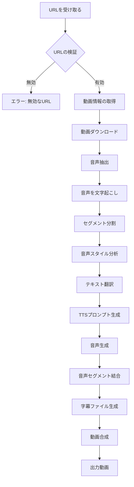

# Twitter Video Translator 処理フロー詳細

## 概要

このドキュメントは、Twitter Video TranslatorがURLを受け取ってから字幕音声付きの動画を返すまでの完全な処理フローを記述しています。

## 処理フロー図



## 詳細な処理ステップ

### 1. URL受信と検証 (`cli.py`)

```python
# CLITranslatorApp.translate_video() - cli.py:56-69
```

- **入力**: Twitter/YouTubeのURL
- **処理**:
  - URLの形式を検証
  - 対応プラットフォームかチェック
  - キャッシュ確認
- **出力**: 検証済みURL

### 2. 動画情報取得とダウンロード (`video_downloader.py`)

```python
# VideoDownloader.download() - video_downloader.py:32-107
```

- **入力**: 検証済みURL
- **処理**:
  - yt-dlpで動画メタデータを取得
  - 動画の存在確認
  - プログレスバー表示でダウンロード
  - キャッシュシステムで重複ダウンロード防止
- **出力**: ダウンロードした動画ファイル（Path）

### 3. 音声抽出 (`video_composer.py`)

```python
# VideoComposer.extract_audio() - video_composer.py:25-51
```

- **入力**: 動画ファイルパス
- **処理**:
  - FFmpegで音声トラック抽出
  - WAV形式（16kHz、モノラル）に変換
  - Whisper APIの要件に合わせて最適化
- **出力**: 音声ファイル（WAV）

### 4. 音声文字起こし (`transcriber.py`)

```python
# Transcriber.transcribe() - transcriber.py:15-81
```

- **入力**: 音声ファイル
- **処理**:
  - Groq Whisper APIに音声送信
  - タイムスタンプ付きで文字起こし
  - セグメント単位で結果を取得
  - リトライ機能（最大3回）
- **出力**: TranscriptionResult（セグメントリスト）

### 5. 音声スタイル分析 (`audio_style_analyzer.py`)

```python
# AudioStyleAnalyzer.analyze_audio_style() - audio_style_analyzer.py:21-162
```

- **入力**: 音声セグメント、文字起こしテキスト
- **処理**:
  - Gemini Flash 2.5で音声分析
  - 感情、速度、トーン、抑揚を抽出
  - JSON形式で構造化
  - リトライ機能付き
- **出力**: スタイル分析結果（感情、速度等）

### 6. テキスト翻訳 (`translator.py`)

```python
# Translator.translate_segments() - translator.py:129-183
```

- **入力**: 文字起こしセグメント、ターゲット言語
- **処理**:
  - セグメントをバッチ処理
  - Gemini APIで翻訳
  - 文脈を保持した翻訳
  - 話者のスタイルを維持
- **出力**: 翻訳されたセグメントリスト

### 7. TTS用プロンプト生成 (`tts.py`)

```python
# TextToSpeech._build_style_prompt() - tts.py:607-656
```

- **入力**: ターゲット言語、スタイルパラメータ
- **処理**:
  - 言語別のプロンプトテンプレート選択
  - スタイル記述の言語別変換
  - 速度・感情・強度の指示を追加
- **出力**: 言語別のTTSプロンプト

例（日本語）:
```
ゆっくりと とても明るく楽しい口調で 次のテキストを読んでください：
```

### 8. 音声生成 (`tts.py`)

```python
# TextToSpeech.generate_speech_segment() - tts.py:83-204
```

- **入力**: 翻訳テキスト、スタイルプロンプト
- **処理**:
  - Gemini Flash 2.5 TTSで音声生成
  - ストリーミング処理で効率化
  - WAVフォーマットに変換
  - リトライ機能（最大3回）
- **出力**: 音声セグメントファイル

### 9. 音声セグメント結合 (`tts.py`)

```python
# TextToSpeech.generate_speech_for_segments() - tts.py:206-439
```

- **入力**: 全セグメントの音声ファイル
- **処理**:
  - 並列処理で高速化
  - セグメント順序を保持
  - 欠落セグメントの再生成
  - タイミング情報の管理
- **出力**: 結合された音声ファイル情報

### 10. 字幕ファイル生成 (`subtitle_generator.py`)

```python
# SubtitleGenerator.generate_srt() - subtitle_generator.py:42-68
```

- **入力**: 翻訳されたセグメント
- **処理**:
  - SRT形式でフォーマット
  - タイムスタンプの精度調整
  - 文字エンコーディング処理
  - 改行の最適化
- **出力**: SRTファイル

### 11. 動画合成 (`video_composer.py`)

```python
# VideoComposer.compose_final_video() - video_composer.py:159-223
```

- **入力**: 元動画、翻訳音声、字幕ファイル
- **処理**:
  - FFmpegで動画、音声、字幕を合成
  - 元の音声トラックを置換
  - 字幕の焼き込み（オプション）
  - コーデックの最適化
- **出力**: 最終動画ファイル

### 12. 出力とクリーンアップ (`cli.py`)

```python
# CLITranslatorApp.translate_video() - cli.py:142-150
```

- **入力**: 最終動画ファイル
- **処理**:
  - 出力ディレクトリに移動
  - ファイル名の整形
  - 一時ファイルの削除
  - 成功メッセージ表示
- **出力**: 完成した翻訳動画

## エラーハンドリング

各ステップで以下のエラーハンドリングを実装：

1. **ネットワークエラー**: リトライ機能（最大3回）
2. **API制限**: 指数バックオフ
3. **ファイル処理エラー**: 一時ファイルの自動クリーンアップ
4. **メモリ不足**: ストリーミング処理で対応

## パフォーマンス最適化

1. **並列処理**: セグメント単位の音声生成を並列化
2. **キャッシング**: 動画、翻訳結果をキャッシュ
3. **ストリーミング**: 大きなファイルはストリーミング処理
4. **プログレスバー**: 長時間処理の進捗表示

## 設定可能なパラメータ

- **ターゲット言語**: 24言語対応
- **音声スタイル**: 話者の声質を選択可能
- **字幕オプション**: 焼き込み/別ファイル
- **品質設定**: 音声・動画の品質調整