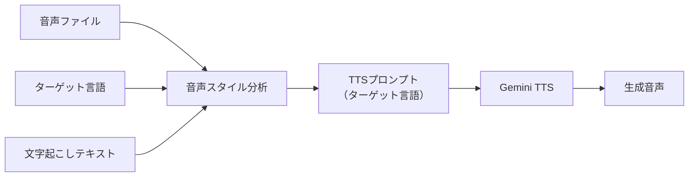

# TTS プロンプト直接生成設計

## 概要

現在の実装では、音声スタイル分析 → TTSスタイルパラメータ → 言語別プロンプトという3段階の変換を行っていますが、これを音声スタイル分析で直接ターゲット言語のTTSプロンプトを生成する設計に変更します。

## 現在の実装の問題点

1. **柔軟性の欠如**: 固定的なスタイルマッピングにより、言語特有の表現が困難
2. **情報の損失**: 分析結果をパラメータに変換する際に細かいニュアンスが失われる
3. **冗長な変換**: 3段階の変換により、コードが複雑化

## 新しい設計

### 処理フロー



### 実装方針

#### 1. AudioStyleAnalyzer の拡張

```python
class AudioStyleAnalyzer:
    async def generate_tts_prompt(
        self, 
        audio_path: Path,
        transcribed_text: str,
        target_language: str,
        target_text: str,
        segment: Optional[SubtitleSegment] = None
    ) -> str:
        """音声を分析し、ターゲット言語のTTSプロンプトを直接生成"""
```

#### 2. 言語別プロンプト生成例

**日本語の場合**:
```
あなたは優れた声優です。以下の音声を分析しました：
- 話者は中年男性で、落ち着いた低い声
- ゆっくりとした話し方で、言葉を慎重に選んでいる
- わずかに悲しみと後悔の感情が込められている
- 声に少し震えがある

この話者の特徴を再現して、次のテキストを読んでください：
[ターゲットテキスト]
```

**英語の場合**:
```
You are a skilled voice actor. Based on the audio analysis:
- Middle-aged male speaker with a calm, deep voice
- Speaking slowly, carefully choosing words
- Slight sadness and regret in the tone
- Voice has a subtle tremor

Reproduce these characteristics and read the following text:
[target text]
```

**中国語の場合**:
```
你是一位专业的配音演员。根据音频分析：
- 中年男性，声音低沉平静
- 语速缓慢，谨慎选词
- 语气中带有一丝悲伤和遗憾
- 声音略有颤抖

请再现这些特征，朗读以下文本：
[目标文本]
```

### 3. 柔軟なプロンプト生成

各言語の特性に応じて：

- **感情表現**: 言語によって感情表現の方法が異なる
- **話速指示**: 「ゆっくり」の概念が言語により異なる
- **声質描写**: 文化的な声の好みを反映
- **特殊効果**: 言語特有の表現（例：日本語の「間」）

### 4. Gemini APIへの統合

```python
# TTSサービスでの使用
class TextToSpeech:
    async def generate_with_prompt(
        self,
        prompt: str,
        text: str,
        output_path: Path
    ) -> Optional[Path]:
        """プロンプトを直接使用して音声生成"""
        
        full_content = f"{prompt}\n\n{text}"
        
        contents = [
            types.Content(
                role="user",
                parts=[
                    types.Part.from_text(text=full_content),
                ],
            ),
        ]
```

## 利点

1. **高い柔軟性**: 言語と文化に応じた自然な指示生成
2. **詳細な制御**: 微細なニュアンスの保持
3. **拡張性**: 新しい言語や表現スタイルの追加が容易
4. **直感的**: プロンプトが人間にも理解しやすい

## 実装ステップ

1. AudioStyleAnalyzerに`generate_tts_prompt`メソッドを追加
2. 言語別のプロンプトテンプレートを定義
3. TTSサービスをプロンプト直接受け取り方式に変更
4. 既存のスタイルパラメータ変換を削除

## サンプルプロンプト

### 感情豊かな表現（日本語）

```
あなたはアニメの声優です。キャラクターは若い女性で：
- 明るく元気な性格
- 話すときに声が弾むような感じ
- 時々声が高くなる
- 笑いながら話すような雰囲気

とても嬉しそうに、次のセリフを言ってください：
「本当に？やったー！ずっと待ってたんだよ！」
```

### ビジネストーン（英語）

```
You are a professional narrator. The speaker is:
- Corporate executive, authoritative voice
- Clear and measured pace
- Confident but not aggressive
- Slight emphasis on key points

Deliver this message with professionalism:
"Our quarterly results exceeded expectations..."
```

## 考慮事項

1. **プロンプト長**: Gemini APIのトークン制限を考慮
2. **一貫性**: セグメント間での話者特性の維持
3. **パフォーマンス**: プロンプト生成の処理時間
4. **評価**: 生成された音声の品質評価方法